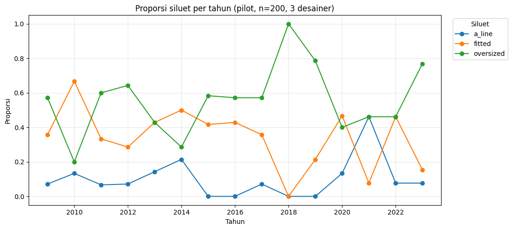
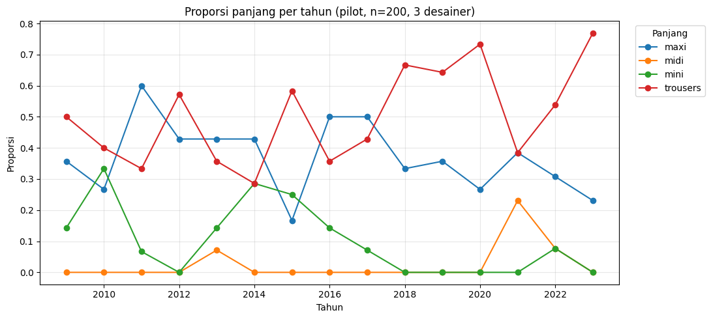

# Laporan Studi Pendahuluan Analisis Tren Fesyen dari Gambar Runway

**Anindya Diany Putri**, **5025231007**

---

## 1. Tujuan

Studi kecil ini saya lakukan untuk mencoba metodologi yang Ibu berikan pada skala kecil, sebelum masuk ke tahap proposal. Ada tiga hal yang saya coba pastikan:

1. Apakah datasetnya bisa diakses dan diolah?
2. Apakah CLIP zero-shot menghasilkan label yang cukup akurat?
3. Kendala teknis apa saja yang perlu diantisipasi?

Saya menggunakan 200 gambar dan taksonomi dua kelompok atribut. Studi ini belum bertujuan menghasilkan temuan tren fesyen.

---

## 2. Data dan Preprocessing

### 2.1 Isi dataset

Dataset VogueRunway di Internet Archive berisi 1.281.633 gambar. Selain gambarnya, ada dua file yang ternyata sangat membantu:

- `VogueRunway.parquet`: metadata lengkap (desainer, musim, tahun, kota, resolusi, url)
- `VogueRunway_image.npy`: CLIP image embedding yang sudah dihitung sebelumnya (ViT-B/32, 512 dimensi)

Karena embedding-nya sudah tersedia, saya bisa menjalankan studi tanpa perlu download 853 GB gambar.

Findings:
- Urutan embedding sesuai dengan urutan metadata.
- Cakupan tahunnya paling jauh sampai Spring 2023.

### 2.2 Penyaringan data

| Tahap filter | Sisa gambar | % dari awal | Reasoning |
|---|---|---|---|
| Data awal | 1.281.633 | 100% | |
| `section` = Collection | 918.509 | 72% | Kolom ini isinya lima macam: Collection (918.509), Details (278.380), Beauty (57.933), Atmosphere (15.117), dan Front Row (11.694). Hanya Collection yang berisi foto look di runway. Sisanya foto close-up aksesoris, makeup, suasana venue, dan penonton.|
| + `category` = Ready-to-Wear | 540.900 | 42% | Menswear (197.254) dan Couture (62.437) punya karakteristik berbeda dan butuh taksonomi sendiri, jadi saya keluarkan. |
| + `season` Spring/Fall | 540.900 | 42% | Resort dan Pre-Fall adalah koleksi antara yang tidak diikuti semua desainer. Ternyata filter ini tidak mengurangi data sama sekali, karena kedua koleksi itu nilai `category`-nya kosong sehingga sudah terbuang di filter sebelumnya. |
| + `width` ≥ 600 px | 435.438 | 34% | Gambar resolusi rendah membuat model visual bekerja kurang baik. |
| + `year` ≥ 2009 | **413.702** | **32%** | Data sebelum 2009 tidak konsisten, rata-rata di bawah 1.500 gambar per tahun dan naik-turun tidak beraturan (tahun 2006 hanya 204 gambar). Mulai 2009 jumlahnya stabil di atas 19.000 per tahun.

### 2.3 Temuan di dataset

**Data Spring 2018 tidak ada.** Semua gambar 2018 berasal dari musim Fall, dan Spring tidak ada sama sekali.

**Metadata `section` tidak 100% akurat.** Waktu melabeli 50 gambar secara manual, saya menemukan 2 gambar yang bukan foto look runway padahal section-nya Collection, atau sekitar 4%.

### 2.4 Sampel yang saya pakai

Ada 23 desainer yang datanya lengkap di seluruh 15 tahun. Dari situ saya pilih tiga dengan karakter desain yang berbeda-beda yaitu **Gucci, Balenciaga, dan Dries Van Noten (5.295 gambar)**

Dari 5.295 itu saya ambil 200 sampel acak, tapi dibagi merata per tahun dan musim supaya setiap titik waktu terwakili. Hasilnya 5–8 gambar per titik musim, di 29 titik (2009–2023, tanpa SS2018). Saya pakai `random_state=42` supaya hasilnya bisa diulang.

---

## 3. Taksonomi

Untuk studi kecil ini saya buat taksonomi sederhana, dua kelompok dengan empat pilihan masing-masing:

| Kelompok | Pilihan |
|---|---|
| Siluet | oversized, fitted, a_line, straight |
| Panjang | mini, midi, maxi, trousers |

Tiap pilihan saya beri tiga variasi prompt untuk keperluan prompt ensemble.

**Kelemahan yang saya sadari:** kelompok "length" sebenarnya mencampur dua hal, jenis bawahan (`trousers`) dan length kelim (`mini`/`midi`/`maxi`). Saya melakukan ini supaya semua look bisa masuk ke salah satu kategori. Kalau pilihannya hanya mini/midi/maxi, look bercelana akan dipaksa masuk salah satunya dan hasilnya pasti salah. 

Nanti di tahap proposal, dua dimensi ini akan saya pisah jadi kelompok atribut yang berbeda, dan taksonominya akan disusun ulang dengan mengacu ke Fashionpedia dan literatur terkait.

Daftar lengkap prompt ada di Lampiran A.

---

## 4. Cara Kerja

### 4.1 Ekstraksi atribut

Embedding gambar saya ambil dari file yang sudah tersedia, lalu dinormalisasi. Prompt teksnya saya encode pakai CLIP ViT-B/32, model yang sama dengan yang dipakai membuat embedding tersebut.

Untuk tiap pilihan atribut, tiga variasi prompt di-encode lalu dirata-ratakan. Ini yang disebut prompt ensemble.

Klasifikasinya pakai cosine similarity dengan `argmax`, tapi **dihitung terpisah per kelompok**. Jadi prompt silhouette hanya dibandingkan sesama prompt silhouette, tidak dicampur dengan prompt length.

### 4.2 Anotasi manual

Saya melabeli 50 gambar secara manual sebagai pembanding, dengan tambahan pilihan `other` di tiap kelompok untuk gambar di luar kategori yang ada. Kolom hasil CLIP saya hapus dulu dari file anotasi supaya penilaian saya tidak terpengaruh prediksi model.

---

## 5. Hasil

### 5.1 Sebaran label

| Silhouette | Anotasi manual (n=50) | Model (n=200) |
|---|---|---|
| a_line | 42% | 10% |
| straight | 22% | **0%** |
| fitted | 16% | 36% |
| oversized | 16% | 54% |
| other | 4% | — |

Yang paling mencolok: kategori `straight` tidak pernah dipilih model sama sekali 200 gambar, padahal saya memakainya di 22% pada anotasi manual.

Pola yang sama terjadi di atribut length. Kategori `midi` saya pakai di 28% anotasi, tapi model hanya memilihnya 2,5%.

### 5.2 Akurasi

| Atribut | Baseline | CLIP zero-shot | Selisih |
|---|---|---|---|
| Silhouette | 0,420 | 0,300 | **−0,120** |
| Panjang | 0,440 | 0,500 | +0,060 |

Baseline di sini adalah proporsi kategori terbanyak di anotasi manual. Artinya, itu akurasi yang didapat kalau menjawab kategori terbanyak untuk semua gambar tanpa melihat gambarnya sama sekali.

Untuk atribut silhouette, hasil CLIP berada **di bawah** baseline. Untuk length, sedikit di atas.

Kalau kategori `other` dan `straight` dikeluarkan, akurasi silhouette naik jadi 0,405 (n=37). Kalau `other` dikeluarkan, akurasi length jadi 0,521 (n=48). Keduanya tetap belum tinggi.

### 5.3 Seberapa yakin modelnya

Saya juga menghitung selisih skor antara kategori yang menang dan kategori peringkat kedua (atribut silhouette, n=200):

| | Nilai |
|---|---|
| Rata-rata | 0,0119 |
| Median | 0,0094 |
| Kuartil 1 | 0,0048 |
| Minimum | 0,00006 |

Sebagai perbandingan, skor kemiripan rata-ratanya 0,276. Jadi selisih median hanya sekitar 3,4% dari nilai skornya.

Seperempat sampel bahkan selisihnya di bawah 0,0048, dan ada yang hampir nol. Artinya di banyak kasus, model sebenarnya hampir tidak bisa membedakan antara dua kategori teratas, keputusannya nyaris seimbang.

Ini menjelaskan kenapa kategori `straight` dan `midi` tidak pernah menang. Kalau selisih antar kategori setipis itu, kategori yang posisinya di tengah memang sulit unggul.

### 5.4 Perbandingan prompt ensemble

Saya bandingkan dua konfigurasi dengan semua parameter lain dibuat sama persis, hanya jumlah prompt per kategori yang berbeda:

| Konfigurasi | Silhouette | Panjang |
|---|---|---|
| Prompt tunggal | 0,260 | 0,380 |
| Prompt ensemble (3 variasi) | 0,300 | 0,500 |
| **Selisih** | **+0,040** | **+0,120** |

Prompt ensemble meningkatkan akurasi di kedua atribut. Untuk atribut length kenaikannya cukup besar, dan justru teknik inilah yang membuat hasilnya melewati baseline (0,440).

### 5.5 Grafik tren



**Gambar 1.** Proporsi siluet per tahun (n=200, 3 desainer).



**Gambar 2.** Proporsi panjang per tahun (n=200, 3 desainer).

Grafik ini saya tampilkan hanya untuk menunjukkan bahwa pipeline-nya berjalan sampai tahap akhir, bukan sebagai temuan tren. Karena akurasi ekstraksinya masih di bawah baseline (Bagian 5.2), pola pada grafik ini belum bisa dianggap sebagai tren fesyen yang sebenarnya.

---

## 6. Temuan dan Keterbatasan

### Temuan

**1. CLIP zero-shot belum bisa dipakai langsung.** Untuk silhouette, akurasinya di bawah baseline. Untuk length, hanya sedikit di atas. Sehingga labelnya belum layak dijadikan dasar analisis tren.

**2. Kategori yang posisinya di tengah tidak pernah menang.** Ini terjadi di kedua atribut: `straight` (di antara fitted dan oversized) dan `midi` (di antara mini dan maxi). Penyebabnya terlihat dari analisis selisih skor di Bagian 5.3, ruang keputusannya terlalu sempit.

**3. Prompt ensemble terbukti membantu.** Naik di kedua atribut, dan biaya komputasinya hampir tidak ada.

**4. Tahap validasi ternyata penting sekali.** Ini yang paling saya rasakan. Tanpa membandingkan dengan anotasi manual, label dari CLIP tetap bisa dibuat grafik tren yang kelihatan rapi dan masuk akal — padahal akurasinya di bawah tebakan. Kalau saya langsung lanjut ke analisis tren, saya tidak akan pernah tahu.

### Keterbatasan

**Sampelnya kecil.** Hanya 200 gambar, 50 di antaranya beranotasi manual, dan terbatas pada tiga desainer.

**Anotasi manualnya belum tentu konsisten.** Ini keterbatasan yang paling saya khawatirkan. Anotasinya saya kerjakan sendiri tanpa pembanding, dan aturan anotasinya (Bagian 4.2) saya susun sambil jalan, bukan ditetapkan lengkap di awal. Jadi saya belum bisa memastikan penilaian saya di gambar-gambar awal sama konsistennya dengan yang di akhir.

Ada juga indikasi saya terlalu longgar memakai kategori `a_line`, proporsinya 42%, dan 6 dari 21 di antaranya saya berikan pada look bercelana, padahal a_line biasanya untuk rok dan gaun.

Karena itu, angka di Bagian 5.2 sebaiknya dibaca sebagai **tingkat kesepakatan antara model dan satu anotator**, bukan sebagai ukuran benar-salah. Sebagian ketidakcocokan bisa jadi berasal dari anotasi saya, bukan dari modelnya. Nanti perlu dihitung inter-annotator agreement dengan anotator kedua untuk tahu batas atas performa yang masuk akal.

Meski begitu, tiga temuan utama di atas tidak bergantung pada ketepatan anotasi saya:

- Kategori `straight` tidak pernah dipilih model, ini sifat modelnya, tidak ada hubungannya dengan label saya
- Analisis selisih skor (5.3) dihitung sepenuhnya dari skor model
- Perbandingan prompt ensemble (5.4) diuji terhadap anotasi yang sama, jadi kalau anotasi saya bias, biasnya berlaku sama untuk kedua konfigurasi dan selisihnya tetap berlaku

**Keterbatasan teknis lain:**

- Embedding bawaan dihitung tanpa cropping, jadi latar belakang dan orang lain di foto ikut memengaruhi hasilnya
- Model yang dipakai (ViT-B/32) adalah varian terkecil dari CLIP
- Taksonominya masih sementara dan belum mengacu literatur

---

## 7. Rencana sampai Desember

| Periode | Kegiatan | Deliverable |
|---|---|---|
| Minggu 4 September | Literature Study (Fashionpedia, penelitian analisis tren fashion) menyusun taksonomi lengkap | Dokumen taksonomi dan prompt |
| Minggu 1-2 Oktober | Preprocessing gambar: deteksi figur manusia, cropping, filter gambar nonrunway | Pipeline preprocessing |
| Minggu 3-4 Oktober | Menghitung ulang embedding dari gambar ter-crop; membandingkan dengan embedding bawaan | Tabel perbandingan akurasi |
| Minggu 1-2 November | Menyusun pedoman anotasi lengkap; perluasan ground truth menjadi 300–500 gambar dengan dua anotator | Dataset ground truth dan nilai Cohen's kappa |
| Minggu 3 November | Perbandingan model (ViT-B/32, ViT-L/14, SigLIP) dan konfigurasi prompt | Tabel perbandingan |
| Minggu 4 November | Penyusunan proposal | Draf proposal |
| Minggu 1 Desember | Revisi draf proposal | Proposal |

Selain itu, ada beberapa hal yang saya temukan selama studi ini dan sepertinya bisa dimanfaatkan:

- Ada kolom `tags` di metadata ternyata sudah berisi hasil deteksi objek seperti "Evening Dress", "Long Sleeve", atau "Overcoat". Ini bisa dipakai sebagai baseline pembanding untuk ekstraksi berbasis CLIP.
- Ada 23 desainer yang datanya lengkap di semua 15 tahun, jadi list brand-nya konsisten sepanjang periode.
- Gambar bisa diambil satu per satu lewat kolom `url` tanpa perlu download archive 6,7 GB per shard. 50 dari 50 gambar berhasil didownload.

---

## Lampiran A: Taksonomi dan Daftar Prompt

```yaml
silhouette:
  oversized:
    - "a runway look with an oversized silhouette"
    - "a model wearing loose, oversized clothing"
    - "an outfit with a baggy, voluminous fit"
  fitted:
    - "a runway look with a fitted silhouette"
    - "a model wearing tight, body-hugging clothing"
    - "a close-fitting tailored outfit"
  a_line:
    - "an A-line silhouette that flares toward the hem"
    - "a garment narrow at the top and wide at the bottom"
    - "an A-line dress or skirt"
  straight:
    - "a straight, column-shaped silhouette"
    - "an outfit with a straight vertical cut"
    - "a simple straight-cut garment"

length:
  mini:
    - "a mini-length garment above the knee"
    - "a very short hemline"
    - "a short mini dress or skirt"
  midi:
    - "a midi-length garment between knee and ankle"
    - "a mid-calf hemline"
    - "a midi dress or skirt"
  maxi:
    - "a maxi-length garment reaching the floor"
    - "a floor-length hemline"
    - "a long maxi dress or skirt"
  trousers:
    - "an outfit with trousers or pants"
    - "a model wearing pants"
    - "a trouser-based look"
```

---

## Lampiran B: Berkas Pendukung

Notebook lengkap beserta berkas pendukung (manifest 200 sampel, hasil ekstraksi model, anotasi manual 50 gambar, hasil evaluasi):

https://colab.research.google.com/drive/1VdGrQ-U68XVTCWWEVpefuez5fatl3AsM?usp=sharing
